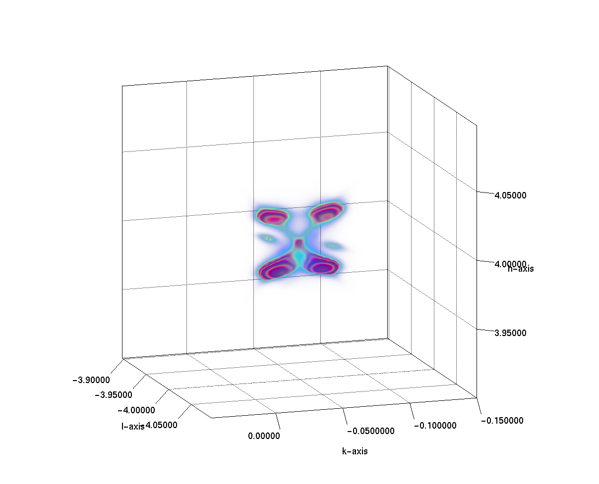
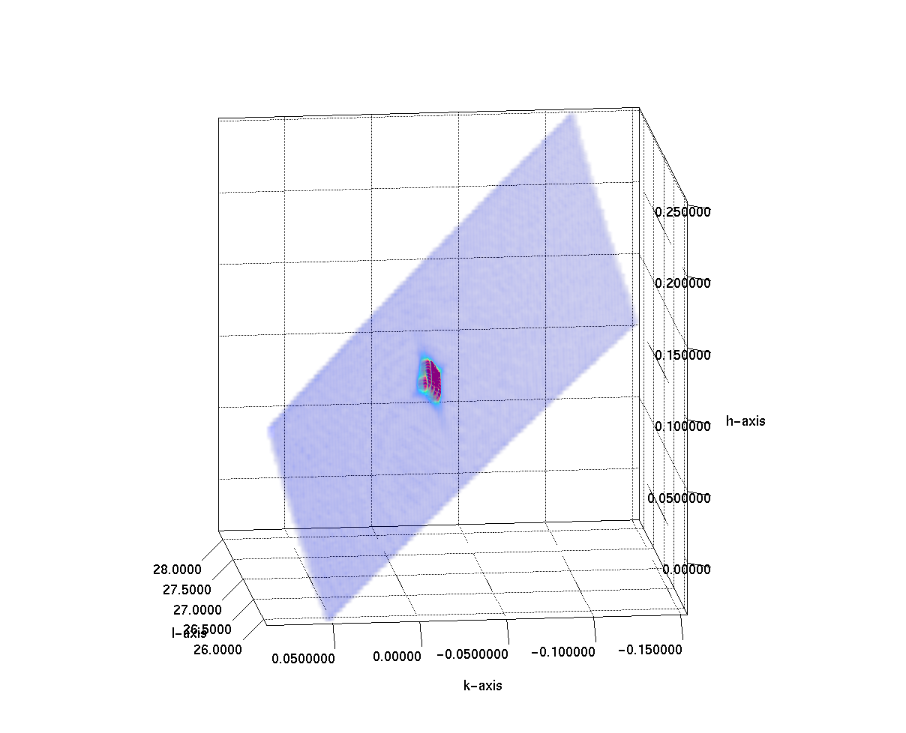

# I16 Example Data

Example NeXus files from beamline I16 at Diamond Light Source.

## Files
Click the links to view the file using myHDF5 viewer.

| Filename                                                                                                                                                         | Description                                       |
|------------------------------------------------------------------------------------------------------------------------------------------------------------------|---------------------------------------------------|
| [1041304.nxs](https://myhdf5.hdfgroup.org/view?url=https%3A%2F%2Fgithub.com%2FDiamondLightSource%2Fi16_msmapper%2Fblob%2Fmaster%2Fexamples%2Fdata%2F1041304.nxs) | Old style NeXus file, rocking curve scan          |
| [processing/1041304_rsmap.nxs](https://myhdf5.hdfgroup.org/view?url=https%3A%2F%2Fgithub.com%2FDiamondLightSource%2Fi16_msmapper%2Fblob%2Fmaster%2Fexamples%2Fdata%2Fprocessing%2F1041304_rsmap.nxs)      | MSmapper processed file of above                  |
| [1109527.nxs](https://myhdf5.hdfgroup.org/view?url=https%3A%2F%2Fgithub.com%2FDiamondLightSource%2Fi16_msmapper%2Fblob%2Fmaster%2Fexamples%2Fdata%2F1109527.nxs)                                                                                                                                                  | New style NeXus file, rocking-scan of single peak |
| [processing/1109527_rsmap_small.nxs](https://myhdf5.hdfgroup.org/view?url=https%3A%2F%2Fgithub.com%2FDiamondLightSource%2Fi16_msmapper%2Fblob%2Fmaster%2Fexamples%2Fdata%2Fprocessing%2F1109527_rsmap_small.nxs)                                                                                                                           | MSmapper processed file of above                  |

Other files contain the detector data, these are linked directly inside the files.

The relative location of the files is important to maintain links within the files, such as links to detector data,
or links to the raw data from processed files.

## Example Notebook
A jupyter notebook showing how to read and plot data from this file is provided in this repo:
 - [msmapper_read_plot_transform.ipynb](https://github.com/DiamondLightSource/i16_msmapper/blob/master/examples/msmapper_read_plot_transform.ipynb)

## New Nexus Files (2025 onwards)
In September 2025, I16 moved to a new structure for their NeXus files.

Here are some of the key data paths:

| Name              | HDF5 Path                                                   |
|-------------------|-------------------------------------------------------------|
| scan_command      | '/entry/scan_command'                                       |
| crystal           | '/entry/sample/name'                                        |
| temp              | '/entry/sample/temperature'                                 |
| unit_cell         | '/entry/sample/unit_cell'                                   |
| energy            | '/entry/sample/beam/incident_energy'                        |
| ubmatrix          | '/entry/sample/ub_matrix'                                   |
| detector_data     | '/entry/instrument/pil3_100k/data                           |
| pixel_size        | '/entry/instrument/pil3_100k/module/fast_pixel_direction'   |
| detector_distance | '/entry/instrument/pil3_100k/transformations/origin_offset' |
| plottable data    | '/entry/measurement/...'                                    |

## Reciprocal-Space-Remapped Volumes
These are generated by msmapper and visualised in Dawn:
### 1041304_rsmap.nxs


### 1109527_rsmap_small.nxs



## NXtransformations
The sample and detector motion is defined in the NeXus file using NXtransformations - 
these are transformation objects attached to each object which can be stacked to produce a series of 
three-dimensional transormation and translation matrices. See: 
https://manual.nexusformat.org/classes/base_classes/NXtransformations.html

To see how this works in practice, you can follow the transformations through the file 1109527.nxs:
  - `/entry/instrument/pil3_100k` depends on
  - `/entry/instrument/pil3_100k/transformations/origin_offset` depends on
  - `/entry/instrument/transformations/offsetdelta` depends on
  - `entry/instrument/transformations/delta` depends on
  - `entry/instrument/transformations/gamma` 

Using the code in this repo, you can build the list 4x4 transformation matrices:
```python
import h5py
from i16_msmapper.nx_transformations import nx_transformations

with h5py.File('12345.nxs') as nxs:
    matrix_list = nx_transformations('/entry/instrument/pil3_100k', index=0, hdf_file=nxs)
```

The NeXus coordinate system is the same as the Diamond Lab-coordinate system:
 - x-axis: horizontal, in plane of ring, away from ring
 - y-axis: vertical, normal to ring, against gravity
 - z-axis: along beam

## Reading NeXus files easily
There are various methods of reading nexus files, including [h5py](https://www.h5py.org/) and [nexusformat](https://github.com/nexpy/nexusformat).
I have developed a new one that allows us to navigate the file without knowledge of the file structure - [HdfMap](https://github.com/DiamondLightSource/hdfmap)

### Example
```python
from hdfmap import create_nexus_map, load_hdf

# HdfMap from NeXus file - get dataset paths:
m = create_nexus_map('file.nxs')
m['energy']  # >> '/entry/instrument/monochromator/energy'
m['signal']  # >> '/entry/measurement/sum'
m['axes0']  # >> '/entry/measurement/theta'
m.get_image_path()  # >> '/entry/instrument/pil3_100k/data'

# load dataset data
with load_hdf('file.nxs') as nxs:
    path = m.get_path('scan_command')
    cmd = nxs[path][()]  # returns bytes data direct from file
    cmd = m.get_data(nxs, 'scan_command')  # returns converted str output
    cmd = m.eval(nxs, 'scan_command.strip()')  # returns evaluated output
    string = m.format_hdf(nxs, "the energy is {energy:.2f} keV")
    d = m.get_dataholder(nxs)  # classic data table, d.scannable, d.metadata

# new in V1.0.0 - evaluate name based expressions in the original file
m('signal / count_time') # >> numpy array
```


## Converting to ASCII files
RAW NeXus files can be converted to ASCII files using the [nexus2srs](https://github.com/DiamondLightSource/nexus2srs) 
python package:
```bash
$ python -m pip install nexus2srs
$ python -m nexus2srs '12345.nxs' '12345.dat' -tiff
```

